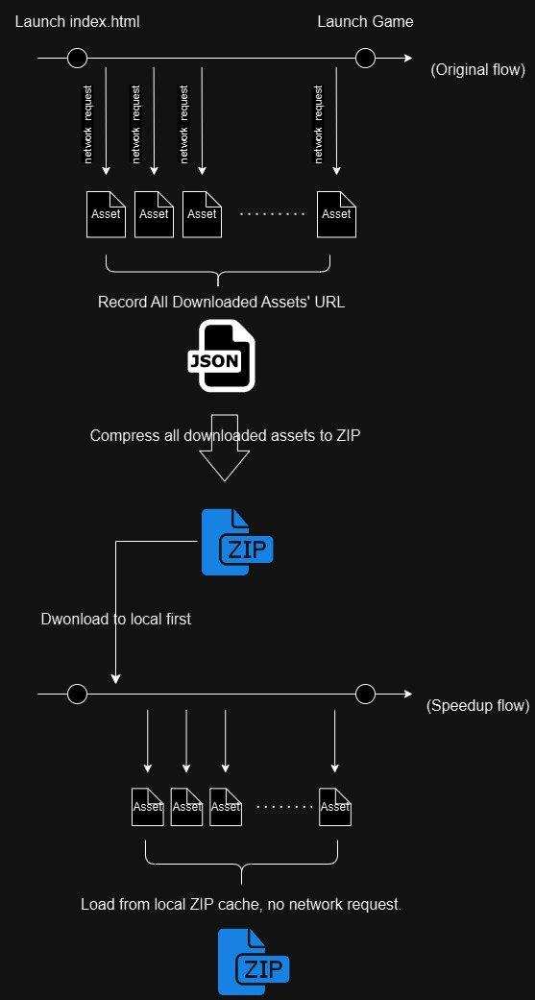
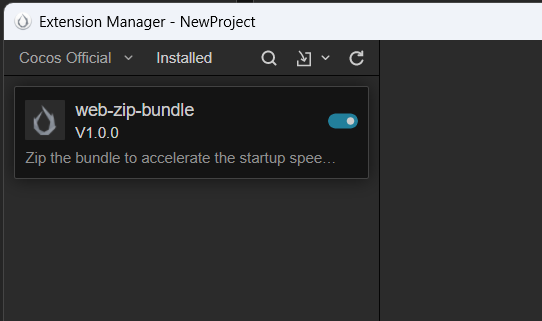
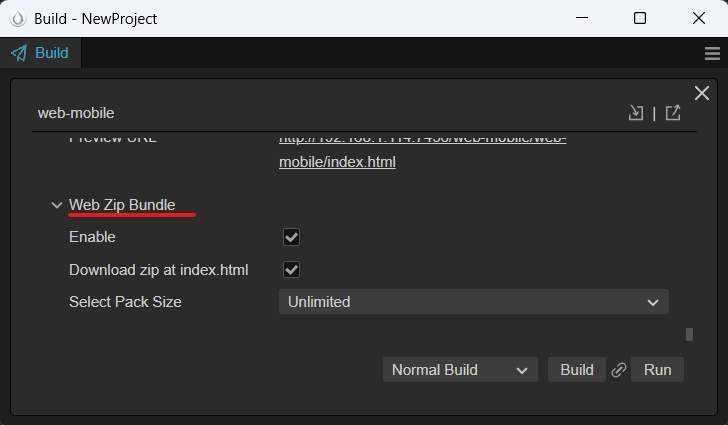
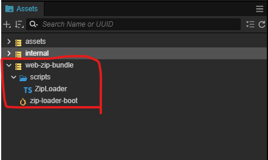
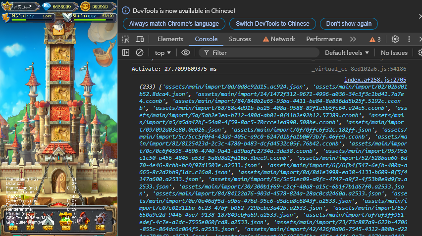
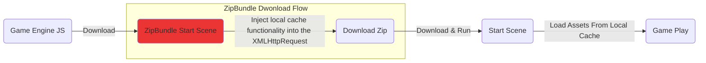
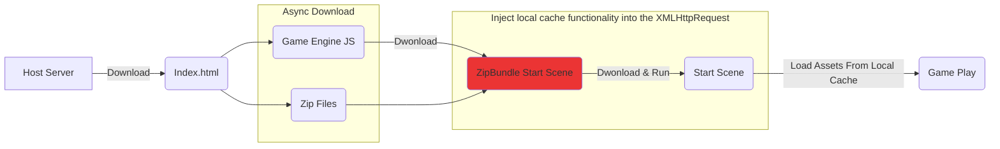
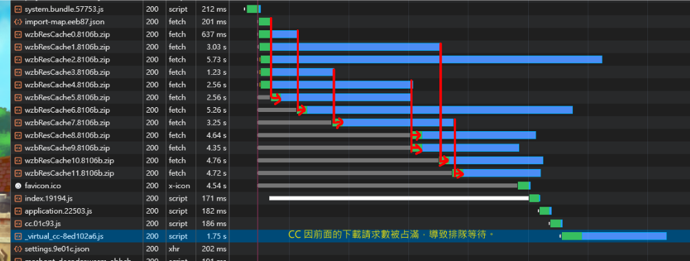

# CC3.WebZipBundle

  

[EN](/README.md) | *中文

网页游戏的启动速度直接影响用户留存与转化。除了`"初始资源总大小"`这一因素外，`"网络请求数量"`也是一个不可忽视的关键，尤其在东南亚等网速及硬件较慢的地区。

该扩展将 web 平台启动时所需的资源（如：PNG、JPG、ASTC、WebP、JSON、CCONB）打包为 zip 文件，从而减少启动时的网络请求数量，加快游戏加载速度。

>「走過路過，別錯過，點顆星星，支持我！」

>*（注：对插件的意见反馈请至 [Cocos 中文论坛](https://forum.cocos.org/t/topic/163849)。）*

>*（注：实现思路来自 Cocos 中文论坛 `haiyoucuv` 分享的文章  [使用 Zip 加速 CocosWeb 加载](https://forum.cocos.org/t/topic/156256)。）*

## DEMO (Host on itch.io)

| ZipBundle | Zip 数 | 浏览器 | 连接规格 | 网速 | 耗时启动 | 网络请求 |
| - | - | - | - | - | - | - |
| On (Method 1) | 1 | Chrome | http1.1 | Fast 4G | 9.62s | 30 reqs |
| On (Method 2) | 1 | Chrome | http1.1 | Fast 4G | 11.98s | 30 reqs |
| --- | --- | --- | --- | --- | --- | --- |
| Off | 0 | Chrome | http1.1 | Fast 4G | 17.22s | 261 reqs |

Host on itch.io：
>* [Enable-ZipLoader](https://bricl.itch.io/cc3webzipbundledemo)
>* [Disable-ZipLoader](https://bricl.itch.io/cc3webzipbundledemo-disable-ziploader)

## 運作原理

## 安装方法

1. 下载项目成 ZIP 文件。

2. 解压后将内容复制到 `${your_project_path}/extensions/web-zip-bundle`。

3. 打开终端
     * 输入 `cd ${your_project_path}/`，安装 jszip `npm install jszip`。

     * 输入 `cd ${your_project_path}/extensions/web-zip-bundle`

         * 安装扩展依赖包 `npm install`

         * 构建扩展 `npm run build`

4. 到 Editor 菜单 Extension -> Extension Manager -> Installed 启用 `web-zip-bundle`。

   

    >(*注：安装方法也可参考官方文档 [【扩展 安装与分享】](https://docs.cocos.com/creator/3.8/manual/zh/editor/extension/install.html) 。*)

## 如何使用

1. 到 Build Setting 新增 `New Build Task` 并选择平台 `WebMobile`。到 Panel 中下拉找到 `web-zip-bundle` 选项。

   * Enable：启用或关闭功能。

        * 启用后，在项目文件夹下自动生成文件夹 `${your_project_path}/wzb-build-config` 和 `assetsUrlRecordList.json`。
          
        * `assetsUrlRecordList.json` 的内容为游戏启动下载所需 Assets URLs 记录，项目构建时会根据此清单打包成 Assets  成 ZIP 文件。
        
            * 内容部分需要手动粘贴，参考 ZipLoader 说明 "如何获取 CC 启动游戏时所需的 Assets Url"。

   * Download zip at index.html：将启动下载 Zip 包的时间提前到 `index.html`。

        * 选项默认值为 `false`

        * 启用后会将下载 ZIP 文件的请求提前到 `index.html` 中啟動，通过异步加载与 CC 引擎下载/初始化同步进行，进一步缩短加载时间。  

        * 要确认下载是否完成，可 `await ZipLoader.getDownloadZipPromise()`。
   
   * Select Pack Size (选择 zip 分割大小)：设置单个 ZIP 文件大小上限，超过则分包。

   

2. 在 Assets 面板中会有 web-zip-bundle 项目。

    * 於 Build Setting 的 `Included Scenes` 设置 `zip-load-boot.scene` 为启动场景（Start Scene）。

    * 打开 `zip-load-boot.scene`。

        * 於在根节点的 `ZipLoader` 组件面板中，填写项目原本的启动场景名称。

    

3. ZipLoader 组件

    * 组件其中一个目的是记录游戏启动所需资源的下载 URL。另一个目的是在原始下载流程之前注入本地缓存功能。

    * 如何获取游戏请求的 Assets 记录？

        * `Is Record Assets Url` 为 `true`，在 CC 请求下载 Assets 时记录其 URLs。 
        
        * 游戏运行时按下 `ALT + W`（仅限 Debug 模式），可以将记录打印到浏览器的控制台（console）。

            

        
        * 通过复制并粘贴记录到 `assetsUrlRecordList.json`，作为打包资源 Zip 文件的依据。

            

        * 可通过调用 ZipLoader 组件 API `isRecordAssetsUrl = false` 停止记录。

            一般来说，我们会选择一个时间点作为 “记录断点” 来停止记录。在这之后，游戏已经启动，后续内容所需的资源将恢复为 “按需加载”。

## 下载模式说明

一般来说，Web 游戏的启动流程如下：

* 游戏启动时，会以 "按需加载 （On Demand）" 的方式加载相关联 Assets，从而产生大量的网络请求。

本扩展将启动游戏所需 `相关联 Assets` 打包成一个或少量的 ZIP 文件并进行下载，以减少网络请求。在中低端安卓手机和网络不快的环境下，可提升游戏启动速度超过 30%。提供的方法有以下两种：

### 方法 1：zip-load-boot.scene (較通用)

* 将新场景 `zip-load-boot.scene` 插入原启动流程中，让其中的 ZipLoader 组件负责下载 ZIP 文件并注入资源本地缓存机制。待完成后，再启动原始启动场景（Start Scene）。  

* 此方法通用且易于定制，可以根据项目需求进行修改。单纯降低网络请求数量，已经足够让启动速度在中低端安卓设备和网速较慢的环境中提升约 `20-30%`。

### 方法 2：Download Zip At Index.html (偷下载时间)

* 在启动游戏的 index.html 中，提前异步下载 ZIP 文件，与引擎核心的下载并行进行，节省时间，从而实现更快的启动速度。  

* 根据实验数据，在中低端安卓设备和网速较慢的环境中，启动速度提升约 30-40%。

    

    | ZipBundle | Zip 数 | 浏览器 | 连接规格 | 网速 | 耗时启动 | 网络请求 |
    | - | - | - | - | - | - | - |
    | On (Method 1) | 1 | Chrome | http1.1 | Fast 4G | 9.62s | 30 reqs |
    | On (Method 2) | 1 | Chrome | http1.1 | Fast 4G | 11.98s | 30 reqs |
    | --- | --- | --- | --- | --- | --- | --- |
    | Off | 0 | Chrome | http1.1 | Fast 4G | 17.22s | 261 reqs |

    

## 如何决定 Zip 资源包的切割数量？

在 Build Setting 设置中有选项 `Select Pack Size` 可以设置分包大小，将资源切割成多个 zip 包。但是...

>*`“将初始资源切割成越多、越小的 zip 包，下载速度就越快？”`*

### HTTP1.1

HTTP1.1 下，Chrome 浏览器对同一域名的最大并发连接数限制为 6 个。当下载请求超过 6 个时，后续的下载请求会排队等待，直到有空闲连接可以处理。

我们使用官方的 UI 示例 [Cocos UI Example](https://github.com/cocos/cocos-example-ui) 进行测试，通过不同的 `Select Pack Size` 设置，将启动资源包分隔成 1 个、3 个、6 个、12 个 Zip 包，测试结果如下：

| ZipBundle | Zip 数 | 浏览器 | 连接规格 | 网速 | 耗时启动 | 网络请求 |
| - | - | - | - | - | - | - |
| On | 1 | Chrome | http1.1 | Fast 4G | 9.62s | 30 reqs |
| On | 3 | Chrome | http1.1 | Fast 4G | 11.40s | 32 reqs |
| On | 6 | Chrome | http1.1 | Fast 4G | 12.36s | 35 reqs |
| On | 12 | Chrome | http1.1 | Fast 4G | 12.47s | 41 reqs |
| --- | --- | --- | --- | --- | --- | --- |
| Off | 0 | Chrome | http1.1 | Fast 4G | 17.22秒 | 261 reqs |

(*注：选择网速为 Fast 4G 的主要原因是较接近整体平均网速环境，尤其在东南亚地区。*)

从 12 个下载并发中可以观察到，当并发数达到上限时，后续的下载请求会进入排队等待。如果等待下载包含 CC 本体 `_virtual_cc.js`，会明显导致启动速度变慢，如下所示：

### HTTP2

HTTP2.0 通过单一 TCP 连接，理论上可以支持超过 6 个的下载并发数，能够实现更多的并发请求。但实际情况仍然取决于 Host Server 的设置，决定一个连接能同时并发多少个下载请求。

### 小结

单一连接中的下载并发数上限决定了初始资源包切分的数量，合适的设置是：*`切割数量 < 并发数上限`*。

## 参考文献

* [WebZipBundle Demo Project](https://github.com/BricL/CC3.WebZipBundle.DemoProject)

* [使用 Zip 加速 CocosWeb 加载](https://forum.cocos.org/t/topic/156256)

* [JSZip](https://stuk.github.io/jszip/)

* [Cocos Creator 官方的 UI 範例 GitHub：Cocos UI Example](https://github.com/cocos/cocos-example-ui)
