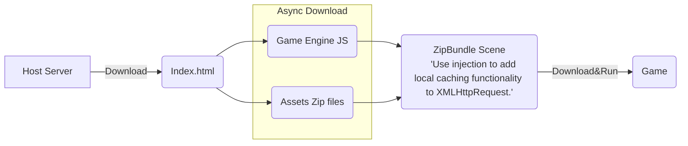
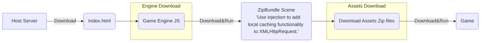

# Web Zip Bundle

[EN](/README.md) | *中文

將 `web platform` 啟動時用到的資源 (如：png、jpg、astc、webp、json、cconb) 紀錄後打包成 zip 檔 ，藉此減少遊戲啟動時對網路請求數量加速啟動時間。

*PS：擴展實踐思路來自 Cocos 中文論壇 `haiyoucuv` 分享的文章 [使用 Zip 加速 CocosWeb 加载](https://forum.cocos.org/t/topic/156256)。*

## 安裝方法

1. 下載專案成 zip。

2. 解壓縮後將內容複製到 `your_project_path/extensions/web-zip-bundle` 中。

3. 至 Editor menu 裡 `Extension/Extension Manager/Installed` 中，找到 web-zip-bunld 並啟動。

   

4. 至 `Build Setting` 中，下拉至最底會看到 web-zip-bundle 的參數選項。

   * Enable (啟動)：啟動或關閉功能。

   * Select Pack Size (選擇zip分割大小)：設定單一包 zip 檔案大小的約略上限，超過就會分包。

   

## 下載流程

一般來說，Web Game 啟動流程如下：

* 遊戲的第一個 `場景 (Scene)` 與 `相關聯的資源 (Assets)` 以 `On Demind` 的方式下載後啟動，因此產生大量且零散的 `網路請求`。

* 而本擴展主要就是將 `場景 (Scene)` 與 `相關聯的資源 (Assets)` 打包成一個或少量 zip 檔案進行下載，達到減少網路請求加速啟動。

### 方法1：Download Zip At Index.html (速度最快)

* 採非同步讓 `zip 檔案` 與 `遊戲引擎核心` 同時下載，節省時間速度最快。

* 在原本 `Game.scene` 之前，先載入一個 `Init.scene` 進行 injection 修改 `XMLHttpRequest` 功能，加入 local cache 讀取機制，若 cahce 命中則無需發出網路請求。

### 方法2：從場景下載 (較通用)

* 在原本 `Game.scene` 之前，先載入一個 `Init.scene` 進行 injection 修改 `XMLHttpRequest` 功能，加入 local cache 讀取機制，若 cahce 命中則無需發出網路請求。

* 在 Init.scene 完成 injection 後，開始啟動 Assets Zip Files 的下載 (因為沒有偷到時間，因此速度較慢)。

## 如何決定 Zip 資源包的切割數量?

在設定選項 `Select Pack Size` 中，可以選擇單一 zip 包體的近似大小，藉此將資源切割成多個 zip 包。

### 在 HTTP1.1 下

*`將初始資源切割成越多、越小各zip包，下載速度就越快？`*

這問題的關鍵在 *`一個連線下，可以同時有多少個併發下載？`*。以 HTTP1.1 在 Chrome 底下一個連線最多 6 各下載併發，當超過時後面的下載請求得排隊等待。

我們用官方的 UI 範例 [Cocos UI Example](https://github.com/cocos/cocos-example-ui) 進行測試，透過不同的 Select Pack Size 設定，將啟動所需資源分隔成 1各、3各、6各、12各 Zip 包測試啟動速度，結果如下：

| ZipBundle | Zip 數 | 瀏覽器 | 連線規格 | 網速 | 耗時啟動 | 網路請求
| ---- | ---- | ---- | ---- | ---- | ---- | ---- |
| On | 1 各 | Chrome | http1.1 | Fast 4G | 9.62秒 | 30 reqs |
| On | 3 各 | Chrome | http1.1 | Fast 4G | 11.40秒 | 32 reqs |
| On | 6 各 | Chrome | http1.1 | Fast 4G | 12.36秒 | 35 reqs |
| On | 12 各 | Chrome | http1.1 | Fast 4G | 12.47秒 | 41 reqs |
| ---- | ---- | ---- | ---- | ---- | ---- | ---- |
| Off | 0 各 | Chrome | http1.1 | Fast 4G | 17.22秒 | 261 reqs |

(*PS：網速選擇 Fast 4G 主因是較接近整體平均網速環境，尤其在東南亞地區。*)

從 12 各下載併發來看，可明顯觀察到當下載併發數達上限，後面下載請求進入排隊等待。若等待的下載項目中有 CC 引擎本體 (`_virtual_cc-8ed102a6.js`)，也會導致整體啟動速度變慢，如下圖所示：

### 那 HTTP2 呢?

HTTP2.0 透過單一 TCP 連線，理論上可以超過 6 個下載併發數非常的多。但實際還是看 Host Server 設定，決定一個連線能同時併發多少個下載請求。

### 小結

單一連線裡下載併發數上限決定切分初始資源包的數量，合適的設定為：*`切割數量 < 併發數上限`*

## [DEMO (Host on itch.io)](https://bricl.itch.io/cc3webzipbundledemo)

* 官方的 UI 範例 [Cocos UI Example](https://github.com/cocos/cocos-example-ui)

## 版本
* v1.0.0
    * 第一個可用版本

## 參考文獻

* [使用 Zip 加速 CocosWeb 加载](https://forum.cocos.org/t/topic/156256)

* [JSZip](https://stuk.github.io/jszip/)
