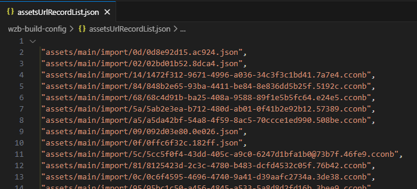
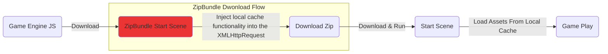
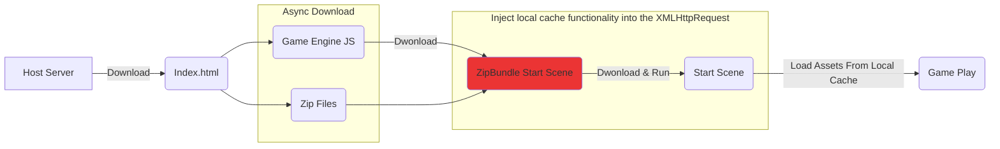

# Web Zip Bundle

*EN | [中文](/README-CN.md)

將 `web platform` 啟動時用到的資源 (如：png、jpg、astc、webp、json、cconb) 紀錄後打包成 zip 檔 ，藉此減少遊戲啟動時對網路請求數量加速啟動時間。

*PS：擴展實踐思路來自 Cocos 中文論壇 `haiyoucuv` 分享的文章 [使用 Zip 加速 CocosWeb 加载](https://forum.cocos.org/t/topic/156256)。*

## 安裝方法

1. 下載專案成 zip。

2. 解壓縮後將內容複製到 `your_project_path/extensions/web-zip-bundle` 中。

3. 至 Editor menu 裡 `Extension/Extension Manager/Installed` 中，找到 web-zip-bunld 並啟動。

   

## 如何使用

1. 至 `Build Setting` 下拉至最底會看到 web-zip-bundle 的參數選項。

   * Enable (啟動)：啟動或關閉功能。

        * 啟動後，會在自動在專案資料夾下生成資料夾 `your_project_path/wzb-build-config`。

            * 其中 `assetsUrlRecordLost.json` 是紀錄 CC 啟動遊戲時所需要的 Assets Url，在專案建置時依此名單進行 Assets Zip 打包。

                ( PS：這部分內容需手動貼入，參閱 `ZipLoader` 說明 `"如何取得 CC 啟動遊戲時所需要的 Assets Url"` )。

   * Select Pack Size (選擇zip分割大小)：設定單一包 zip 大小的約略上限，超過就分包。

   

2. 在 Assets Panel 中會出現 web-zip-bunld 項目。

    * 請在 Build Setting 中 `Included Scenes` 設定 `zip-load-boot.scene` 成專案的 `Start Scene`。

    * 開啟 `zip-load-boot.scene`。

        * 根節點上 `ZipLoader Component` 面板輸入專案原來的 `Start Scene` 名稱。

3. ZipLoader Component

    * `zip-load-boot.scene` 中的 `ZipLoader` 會將 Record Assets Url 與 Load Assets from Local-cache 兩個功能加入CC中。

    * 如何取得 CC 啟動遊戲時所需要的 Assets Url?

        * 啟動選項 `Is Record Assets Url`，會在 CC 每次下載資源時將所用到的資源記錄下來
        
            * 透過 `ALT + W` 可將記錄列表打印在 console 中，透過複製、貼上至 `assetsUrlRecordLost.json`，作為 Zip 打包資源的依據。

                

                

            * 該選項預設 `true`，在 `zip-load-boot.scene` 載入後就會進行紀錄。

            * 可透過 ZipLoader 的 `isRecordAssetsUrl` 設為 `false` 來停止紀錄。

                * 一般來說，我們決定一個時間點為 "記錄斷點" 停止紀錄。在這之後遊戲已啟動，內容後續所需的資源 "下載/載入' 將復原 `"On Demind 用甚麼拿甚麼"`。

## 下載流程

一般來說，Web Game 啟動流程如下：

* 解析執行第一個 `起始場景 (Start Scene)` 會把 `相關聯資源 (Assets)` 以 `"On Demind 用甚麼拿甚麼"` 的方式用到什麼下什麼，因此產生大量、零散的 `網路請求`。

* 而本擴展就是將 `起始場景 (Start Scene)` 用到的 `相關聯的資源 (Assets)` 打成一個或少量 zip 包進行下載，減少網路請求加速啟動。尤其在中、低階安卓手機與網路不那麼快速的國境，能提升遊戲的啟動速度達 50+% 之多。

### 方法1：ZipBundle 場景下載 (通用)

* 在原流程 `起始場景 (Start Scene)` 前插入 `ZipBundle Start Scene` 場景，該場景會對 `XMLHttpRequest` 注入 Local Cache 功能並啟動 Zip 包的下載。

* 這個方法比較通用且易於客製化，依照專案的需求進行修改，參考範場景 (zip-loader-boot.scene)。

* 缺點在於沒偷到下載時間，只單純降低了網路請求數量，但單就這樣也足夠讓啟動速度在中、低階安卓手機快上個 `20 ~ 30%`。

### 方法2：Download Zip At Index.html (偷下載時間)

* 非同步下載 `Zip 檔案` 與 `遊戲引擎核心`，節省時間速度最快。

* 這個方法偷到了下載CC引擎與引擎初始化時間，就實驗 [Cocos UI Example](https://github.com/cocos/cocos-example-ui) 數據來看可在快 `10 ~ 20%`：

    | ZipBundle | Zip 數 | 瀏覽器 | 連線規格 | 網速 | 耗時啟動 | 網路請求
    | ---- | ---- | ---- | ---- | ---- | ---- | ---- |
    | On 方法1 | 1 各 | Chrome | http1.1 | Fast 4G | 9.62秒 | 30 reqs |
    | On 方法2 | 1 各 | Chrome | http1.1 | Fast 4G | 11.98秒 | 30 reqs |
    | ---- | ---- | ---- | ---- | ---- | ---- | ---- |
    | Off | 0 各 | Chrome | http1.1 | Fast 4G | 17.22秒 | 261 reqs |

## 如何決定 Zip 資源包的切割數量?

在設定選項 `Select Pack Size` 中，可以選擇單一 zip 包體的近似大小，藉此將資源切割成多個 zip 包。

### 在 HTTP1.1 下

*`將初始資源切割成越多、越小各zip包，下載速度就越快？`*

這問題的關鍵在 *`一個連線下，可以同時有多少個併發下載？`*。以 HTTP1.1 在 Chrome 底下一個連線最多 6 各下載併發，當超過時後面的下載請求得排隊等待。

我們用官方的 UI 範例 [Cocos UI Example](https://github.com/cocos/cocos-example-ui) 進行測試，透過不同的 Select Pack Size 設定，將啟動所需資源分隔成 1各、3各、6各、12各 Zip 包測試啟動速度，結果如下：

| ZipBundle | Zip 數 | 瀏覽器 | 連線規格 | 網速 | 耗時啟動 | 網路請求
| ---- | ---- | ---- | ---- | ---- | ---- | ---- |
| On | 1 各 | Chrome | http1.1 | Fast 4G | 9.62秒 | 30 reqs |
| On | 3 各 | Chrome | http1.1 | Fast 4G | 11.40秒 | 32 reqs |
| On | 6 各 | Chrome | http1.1 | Fast 4G | 12.36秒 | 35 reqs |
| On | 12 各 | Chrome | http1.1 | Fast 4G | 12.47秒 | 41 reqs |
| ---- | ---- | ---- | ---- | ---- | ---- | ---- |
| Off | 0 各 | Chrome | http1.1 | Fast 4G | 17.22秒 | 261 reqs |

(*PS：網速選擇 Fast 4G 主因是較接近整體平均網速環境，尤其在東南亞地區。*)

從 12 各下載併發來看，可明顯觀察到當下載併發數達上限，後面下載請求進入排隊等待。若等待的下載項目中有 CC 引擎本體 (`_virtual_cc-8ed102a6.js`)，也會導致整體啟動速度變慢，如下圖所示：

### 那 HTTP2 呢?

HTTP2.0 透過單一 TCP 連線，理論上可以超過 6 個下載併發數非常的多。但實際還是看 Host Server 設定，決定一個連線能同時併發多少個下載請求。

### 小結

單一連線裡下載併發數上限決定切分初始資源包的數量，合適的設定為：*`切割數量 < 併發數上限`*

## DEMO (Host on itch.io)

* [Enable-ziploader](https://bricl.itch.io/cc3webzipbundledemo)

* [Disable-Ziploader](https://bricl.itch.io/cc3webzipbundledemo-disable-ziploader)

## 版本
* v1.0.0
    * 第一個可用版本

## 參考文獻

* [使用 Zip 加速 CocosWeb 加载](https://forum.cocos.org/t/topic/156256)

* [JSZip](https://stuk.github.io/jszip/)

* Cocos Creator 官方的 UI 範例 GitHub： [Cocos UI Example](https://github.com/cocos/cocos-example-ui)
