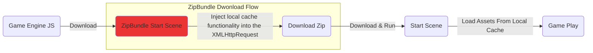
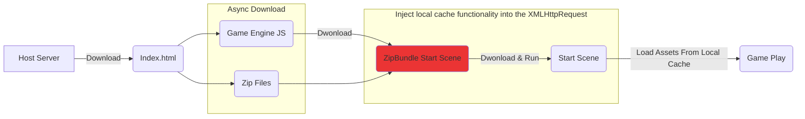

# CC3.WebZipBundle

  

*EN | [中文](/README-CN.md)

In H5 games, launch time is a critical factor influencing user retention and conversion. Besides the `total package size`, the `number of network requests` is another key factor, especially in regions like Southeast Asia, where internet speeds and hardware capabilities are often limited.

The extension for Cocos Creator 3.x packages all resource files (e.g., PNG, JPG, ASTC, WebP, JSON, CCOBN) into a ZIP file to reduce network requests and speed up the game's loading time.

(*Note: Thie implementation is inspired by an article shared by `haiyoucuv` on the Cocos Chinese forum: [使用 Zip 加速 CocosWeb 加载](https://forum.cocos.org/t/topic/156256).*)

## Installation

1. Download ZIP package from github.

2. Decompress the file and copy the content to `${your_project_path}/extensions/web-zip-bundle`.

3. Open the terminal
     * Enter `cd ${your_project_path}/` and run `npm install jszip` to install jszip.

     * `cd ${your_project_path}/extensions/web-zip-bundle`

         * Enter `npm install`，install dependency packages.

         * Enter `npm run build`，build the extension.

4. Go to the Editor menu `Extension -> Extension Manager -> Installed` to activate the extension.

   

(*Note：You can also check out the official docs for installation instrucctions [【擴展 安装与分享】](https://docs.cocos.com/creator/3.8/manual/zh/editor/extension/install.html) 。*)

## How to Use

1. Go to `Build Setting` and select the `web-zip-bundle` option from the dropdown.

   * Enable：Turn on/off the extension

        * After enabling, the extension will auto generate the folder `${your_project_path}/wzb-build-config` and the file `assetsUrlRecordList.json` in the project directory.
          
        * The `assetsUrlRecordList.json` contains a record of the assets required to launch the game. During the build process, all assets listed in this file will be packaged into a ZIP file. 
        
        The contents of `assetsUrlRecordList.json` need to be manually added. Refer to the ZipLoader documentation for details on `"How to get the assets required to launch the game"`.

   * Download ZIP at index.html：Start downloading the ZIP package in `index.html`.

        * The Default is `false`

        * This will move the ZIP download request to `index.html` and use async loading to further reduce the download time.

        * To check if the download is complete, you can `await ZipLoader.getDownloadZipPromise()`.
   
   * Select Pack Size (Choose zip split size)：Set the maximum size for a single zip file. If it goes over, it'll split into multiple files.

   

2. In the `Assets Panel`, the new item, `web-zip-bundle` will appear.

    * In the `Build Setting`, set `zip-load-boot.scene` as the project's Start Scene.

    * Open `zip-load-boot.scene`.

        * In the ZipLoader component panel on the root node, enter the original name of the start scene.

3. ZipLoader Component

    * One of the purposes is to record the download URLs of the assets required for game startup. The sceond purpose is to inject local cache functionality before the original download process.

    * How to get the asset request records for the game?

        * Set `Is Record Assets Url` to `true` in the ZipLoader inspector. This will record the URLs of every asset download request made by the engine. 

        * During gameplay, press `ALT + W (Debug Only)` to print the record to the browser console.

            

        
        * Copy and paste the content into `assetsUrlRecordList.json`, which will serve as the basis for the Zip packing resources.

            

        * Set `isRecordAssetsUrl` to `false` to stop recording.

            Generally, we set a specific point in time to stop recording, and the recorded data representes the startup resources for the game.

## Description of Download Modes

Generally, the startup process for a Web Game is as follows:

* 解析執行第一個 `起始場景 (Start Scene)` 會把 `相關聯資源 (Assets)` 以 `"On Demind (用甚麼、拿甚麼)"` 的方式用到什麼下什麼，因此產生大量、零散的 `網路請求`。

* 而本擴展就是將 `起始場景 (Start Scene)` 用到的 `相關聯的資源 (Assets)` 打成一個或少量 zip 包進行下載，減少網路請求。在中、低階安卓手機、網速不快的環境下，可提升遊戲啟動速度達 30+% 之多。

擴展提供的方法有以下兩種：

### Method 1: Using `zip-load-boot.scene` (General)

* 在原流程 `起始場景 (Start Scene)` 前插入 `zip-load-boot.scene` 場景，該場景會對注入 Assets Local Cache 功能並啟動 Zip 包的下載。

* 此方法通用且易於客製化，可依專案需求進行修改。單純降低網路請求數量，已足夠讓啟動速度在中、低階安卓、網速較低的環境快上個 `20 ~ 30%`。

### Method 2：Download Zip At Index.html

* 非同步下載 `Zip 檔案` 與 `遊戲引擎核心`，節省時間速度最快。

* 這個方法偷到了下載CC引擎與引擎初始化時間，就實驗 [Cocos UI Example](https://github.com/cocos/cocos-example-ui) 數據來看可在快 `10 ~ 20%`：

    | ZipBundle | Zip 數 | 瀏覽器 | 連線規格 | 網速 | 耗時啟動 | 網路請求
    | ---- | ---- | ---- | ---- | ---- | ---- | ---- |
    | On 方法1 | 1 各 | Chrome | http1.1 | Fast 4G | 9.62秒 | 30 reqs |
    | On 方法2 | 1 各 | Chrome | http1.1 | Fast 4G | 11.98秒 | 30 reqs |
    | ---- | ---- | ---- | ---- | ---- | ---- | ---- |
    | Off | 0 各 | Chrome | http1.1 | Fast 4G | 17.22秒 | 261 reqs |

## How to Determine the Number of Split Zip Files?

在 Build Setting 設定中有選項 `Select Pack Size` 可設定分包大小，將資源切割成多個 zip 包。但...

*`“將初始資源切割成越多、越小各zip包，下載速度就越快？”`*

### Under HTTP1.1

HTTP1.1 在 Chrome 下一個連線最多 6 各下載併發，當超過後續下載請求得排隊等待。

我們用官方的 UI 範例 [Cocos UI Example](https://github.com/cocos/cocos-example-ui) 進行測試，透過不同 Select Pack Size 的設定，將啟動資源包分隔成 1各、3各、6各、12各 Zip 測試速度結果如下：

| ZipBundle | Zip 數 | 瀏覽器 | 連線規格 | 網速 | 耗時啟動 | 網路請求
| ---- | ---- | ---- | ---- | ---- | ---- | ---- |
| On | 1 各 | Chrome | http1.1 | Fast 4G | 9.62秒 | 30 reqs |
| On | 3 各 | Chrome | http1.1 | Fast 4G | 11.40秒 | 32 reqs |
| On | 6 各 | Chrome | http1.1 | Fast 4G | 12.36秒 | 35 reqs |
| On | 12 各 | Chrome | http1.1 | Fast 4G | 12.47秒 | 41 reqs |
| ---- | ---- | ---- | ---- | ---- | ---- | ---- |
| Off | 0 各 | Chrome | http1.1 | Fast 4G | 17.22秒 | 261 reqs |

(*註：網速選擇 Fast 4G 主因是較接近整體平均網速環境，尤其在東南亞地區。*)

從 12 各下載併發可觀察到當併發數達上限，後續的下載請求會排隊等待。若等待下載中有 CC 本體 (`_virtual_cc-8ed102a6.js`)，會更明顯導致啟動速度變慢，如下圖所示：

### HTTP2

HTTP2.0 透過單一 TCP 連線，理論上可以超過 6 個下載併發數非常的多。但實際還是看 Host Server 設定，決定一個連線能同時併發多少個下載請求。

### Summary

The max number of concurrent downloads in a single connection decides how many splits the initial resource package should have. A good rule of thumb is: number of splits < max concurrent downloads.

## DEMO (Host on itch.io)

* [Enable-ziploader](https://bricl.itch.io/cc3webzipbundledemo)

* [Disable-Ziploader](https://bricl.itch.io/cc3webzipbundledemo-disable-ziploader)

## Versions

* v1.0.0

    * The First Available Version

## References

* [WebZipBundle Demo Project](https://github.com/BricL/CC3.WebZipBundle.DemoProject)

* [使用 Zip 加速 CocosWeb 加载](https://forum.cocos.org/t/topic/156256)

* [JSZip](https://stuk.github.io/jszip/)

* Cocos Creator 官方的 UI 範例 GitHub： [Cocos UI Example](https://github.com/cocos/cocos-example-ui)
