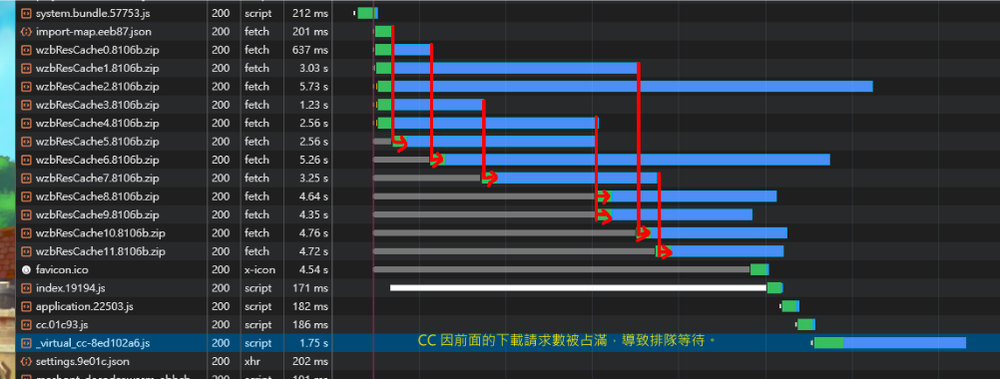

# Web Zip Bundle
將 `web platform` 啟動時用到的資源 (如：png、jpg、astc、webp、json、cconb) 紀錄後打包成 zip 檔 ，藉此減少遊戲啟動時對網路請求數量加速啟動時間。

## 安裝方法

1. 下載專案成 zip。

2. 解壓縮後將內容複製到 `your_project_path/extensions/web-zip-bundle` 中。

3. 至 Editor menu 裡 `Extension/Extension Manager/Installed` 中，找到 web-zip-bunld 並啟動。

   

4. 至 `Build Setting` 中，下拉至最底會看到 web-zip-bundle 的參數選項。

   * Enable (啟動)：啟動或關閉功能。

   * Select Pack Size (選擇zip分割大小)：設定單一包 zip 檔案大小的約略上限，超過就會分包。

   

## [itch.io Demo](https://bricl.itch.io/cc3webzipbundledemo)

修改官方 [cocos-example-ui](https://github.com/cocos/cocos-example-ui)，建置為 `Web Platform` 應用，並匯入擴展 `Web Zip Bundle` 量測遊戲啟動速度的改進。

## 如何決定 Zip 資源包的切割數量?

在設定選項 `Select Pack Size` 中，可以選擇單一 zip 包體的近似大小，藉此將資源切割成多個 zip 包。

### 在 HTTP1.1 下

*`那是切割得越多越小，下載速度就越快？`*

這問題的關鍵在 *`一個連線下，可以同時有多少個併發下載？`*。以 HTTP1.1 在 Chrome 底下一個連線最多 6 各下載併發，當超過時後面的下載請求得排隊等待。

我們用官方範例 [Cocos UI Example](https://github.com/cocos/cocos-example-ui) 進行測試，透過不同的 Select Pack Size 設定，將啟動所需資源分隔成 1各、3各、6各、12各 Zip 包測試啟動速度，結果如下：

| Zip 數 | 瀏覽器 | 連線規格 | 網速 | 耗時啟動 | 網路請求
| ---- | ---- | ---- | ---- | ---- | ---- |
| 1 各 | Chrome | http1.1 | Fast 4G | 9.62秒 | 30各 |
| 3 各 | Chrome | http1.1 | Fast 4G | 11.40秒 | 32各 |
| 6 各 | Chrome | http1.1 | Fast 4G | 12.36秒 | 35各 |
| 12 各 | Chrome | http1.1 | Fast 4G | 12.47秒 | 41各 |
| ---- | ---- | ---- | ---- | ---- | ---- |
| 關閉 ZipBundle | Chrome | http1.1 | Fast 4G | 17.22秒 | 261各 |

從 12 各下載併發來看，可以明顯觀察到前面的下載併發數到達上限，導致後面的下載請求排隊等待。圖中可知，排隊等待也耽誤了 CC 引擎的載入，致整體啟動速度慢了下來。

### 那 HTTP2 呢?

HTTP2.0 透過單一 TCP 連線，理論上可以超過 6 個下載併發數非常的多。但實際上還是要看 Host Server 的設定，來決定一個連線下能同時併發多少個下載請求。

### 小結

單一連線的下載併發數上限決定了初始資源包的切分大小，最佳切割數量應該 < 併發數上限，為最合適之設定。

## 版本
* v1.0.0
    * 第一個可用版本
