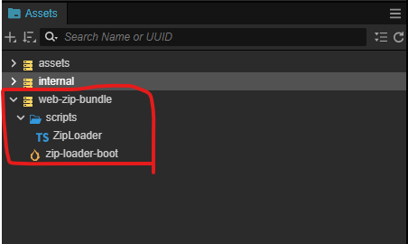

# CC3.WebZipBundle

  

*EN | [中文](/README-CN.md)

In H5 games, launch time is a critical factor influencing user retention and conversion. Besides the `total package size`, the `number of network requests` is another key factor, especially in regions like Southeast Asia, where internet speeds and hardware capabilities are often limited.

The extension for Cocos Creator 3.x packages all resource files (e.g., PNG, JPG, ASTC, WebP, JSON, CCOBN) into a ZIP file to reduce network requests and speed up the game's loading time.

(*Note: Thie implementation is inspired by an article shared by `haiyoucuv` on the Cocos Chinese forum: [使用 Zip 加速 CocosWeb 加载](https://forum.cocos.org/t/topic/156256).*)

## Installation

1. Download ZIP package from github.

2. Decompress the file and copy the content to `${your_project_path}/extensions/web-zip-bundle`.

3. Open the terminal
     * Enter `cd ${your_project_path}/` and run `npm install jszip` to install jszip.

     * `cd ${your_project_path}/extensions/web-zip-bundle`

         * Enter `npm install`，install dependency packages.

         * Enter `npm run build`，build the extension.

4. Go to the Editor menu `Extension -> Extension Manager -> Installed` to activate the extension.

   

(*Note：You can also check out the official docs for installation instrucctions [【擴展 安装与分享】](https://docs.cocos.com/creator/3.8/manual/zh/editor/extension/install.html) 。*)

## How to Use

1. Go to `Build Setting` and select the `web-zip-bundle` option from the dropdown.

   * Enable：Turn on/off the extension

        * After enabling, the extension will auto generate the folder `${your_project_path}/wzb-build-config` and the file `assetsUrlRecordList.json` in the project directory.
          
        * The `assetsUrlRecordList.json` contains a record of the assets required to launch the game. During the build process, all assets listed in this file will be packaged into a ZIP file. 
        
        The contents of `assetsUrlRecordList.json` need to be manually added. Refer to the ZipLoader documentation for details on `"How to get the assets required to launch the game"`.

   * Download ZIP at index.html：Start downloading the ZIP package in `index.html`.

        * The Default is `false`

        * This will move the ZIP download request to `index.html` and use async loading to further reduce the download time.

        * To check if the download is complete, you can `await ZipLoader.getDownloadZipPromise()`.
   
   * Select Pack Size (Choose zip split size)：Set the maximum size for a single zip file. If it goes over, it'll split into multiple files.

   

2. In the `Assets Panel`, the new item, `web-zip-bundle` will appear.

    * In the `Build Setting`, set `zip-load-boot.scene` as the project's Start Scene.

    * Open `zip-load-boot.scene`.

        * In the ZipLoader component panel on the root node, enter the original name of the start scene.

    

3. ZipLoader Component

    * One of the purposes is to record the download URLs of the assets required for game startup. The sceond purpose is to inject local cache functionality before the original download process.

    * How to get the asset request records for the game?

        * Set `Is Record Assets Url` to `true` in the ZipLoader inspector. This will record the URLs of every asset download request made by the engine. 

        * During gameplay, press `ALT + W (Debug Only)` to print the record to the browser console.

            

        
        * Copy and paste the content into `assetsUrlRecordList.json`, which will serve as the basis for the Zip packing resources.

            

        * Set `isRecordAssetsUrl` to `false` to stop recording.

            Generally, we set a specific point in time to stop recording, and the recorded data representes the startup resources for the game.

## Description of Download Modes

Generally, the startup process for a Web Game is as follows:

* All the initial assets associated with the start scene are downloaded on demand, resulting in a large number of scattered network requests.

This extension bundles the assets for the Start Scene into one or a few zip files, cutting down on network requests. On mid- to low-end Android devices or slower internet, it can speed up game startup by over 30%. We provide two methods:

### Method 1: Using `zip-load-boot.scene` (General)

* Insert a new scene, `zip-load-boot.scene`, into the original startup pipeline. This scene provides three key functionalities: injecting the Assets Local Cache, downloads ZIP files, and records the required asset URLs during  game startup.

* This method is flexible and customizable. Reducing network requests alone can boost startup speed by `20-39%` on mid- to low-end Android devices or slower networks.

### Method 2：Download Zip At Index.html

* Asynchronously downloading the ZIP files and game engine core saves the most time and offers the fastest speed.

* This method takes advantage of downloading the CC engine and initializing it simultaneously. Based on experiment data, it can speed up the process by 30–40% on mid- to low-end Android devices or slower networks.

    | ZipBundle | Number of Zips | Browser | Connection Type | Network Speed | Startup Time | Network Reqs
    | ---- | ---- | ---- | ---- | ---- | ---- | ---- |
    | On (Method 1) | 1 | Chrome | http1.1 | Fast 4G | 9.62s | 30 reqs |
    | On (Method 2) | 1 | Chrome | http1.1 | Fast 4G | 11.98s | 30 reqs |
    | ---- | ---- | ---- | ---- | ---- | ---- | ---- |
    | Off | 0 | Chrome | http1.1 | Fast 4G | 17.22s | 261 reqs |

## How to Determine the Number of Split Zip Files?

In the Build Settings, the "Select Pack Size" option allows you to split resources into multiple zip files. However...

*`"Does splitting the initial resources into more, smaller zip files lead to faster download speeds ?"`*

### Under HTTP1.1

In Chrome with HTTP1.1, a single connection supports up to 6 concurrent downloads. Any additional download requests will be queued.

We tested different `Select Pack Size` settings using the official  [Cocos UI Example](https://github.com/cocos/cocos-example-ui). The initial assets were split into 1, 3, 6 and 12 ZIP files, with the results shown below:

| ZipBundle | Number of Zips | Browser | Connection Type | Network Speed | Startup Time | Network Reqs
| ---- | ---- | ---- | ---- | ---- | ---- | ---- |
| On | 1 | Chrome | http1.1 | Fast 4G | 9.62s | 30 reqs |
| On | 3 | Chrome | http1.1 | Fast 4G | 11.40s | 32 reqs |
| On | 6 | Chrome | http1.1 | Fast 4G | 12.36s | 35 reqs |
| On | 12 | Chrome | http1.1 | Fast 4G | 12.47s | 41 reqs |
| ---- | ---- | ---- | ---- | ---- | ---- | ---- |
| Off | 0 | Chrome | http1.1 | Fast 4G | 17.22s | 261 reqs |

(*Note: Fast 4G simulation is used because it’s closer to real-world internet speeds, especially in Southeast Asia.*)

The results show that when concurrent downloads reach the maximum of 12, any additional network requests will be queued. If `_virtual_cc-8ed102a6.js` from CC is among the queued requests, it can noticeably delay the startup time, as illustrated below:

### HTTP2

In theory, a single TCP connection can handle more than 6 concurrent downloads. However, in practice, this depends on the host server's configuration.

### Summary

The max number of concurrent downloads in a single connection decides how many splits the initial resource package should have. A good rule of thumb is: `"number of splits < max concurrent downloads"`.

## DEMO (Host on itch.io)

* [Enable-ziploader](https://bricl.itch.io/cc3webzipbundledemo)

* [Disable-Ziploader](https://bricl.itch.io/cc3webzipbundledemo-disable-ziploader)

## Versions

* v1.0.0

    * The First Available Version

## References

* [WebZipBundle Demo Project](https://github.com/BricL/CC3.WebZipBundle.DemoProject)

* [使用 Zip 加速 CocosWeb 加载](https://forum.cocos.org/t/topic/156256)

* [JSZip](https://stuk.github.io/jszip/)

* Cocos Creator 官方的 UI 範例 GitHub： [Cocos UI Example](https://github.com/cocos/cocos-example-ui)
