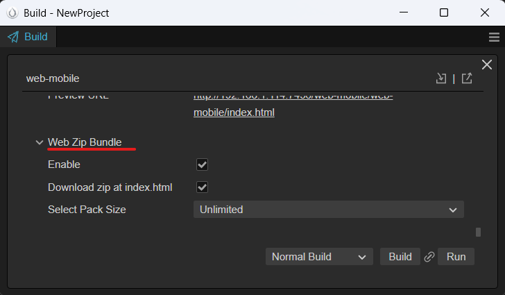

# CC3.WebZipBundle

  

*EN | [中文](/README-CN.md)

網頁遊戲的啟動速度直接影響用戶留存與轉化。除了 `"初始資源總大小"` 這一因素外，`"網路請求數量"` 也是一個不可忽視的關鍵，尤其在東南亞等網速及硬體較慢的地區。

此擴展將 web 平台 啟動時所需的資源（如：PNG、JPG、ASTC、WebP、JSON、CCONB）打包為 zip 檔，從而減少啟動時的網路請求數量，加快遊戲載入速度。

(*註：實踐思路來自 Cocos 中文論壇 `haiyoucuv` 分享的文章 [使用 Zip 加速 CocosWeb 加载](https://forum.cocos.org/t/topic/156256)。*)

## 安裝方法

1. 下載專案成 zip。

2. 解壓縮後將內容複製到 `${your_project_path}/extensions/web-zip-bundle`。

3. 開啟終端機
     * `cd ${your_project_path}/` 輸入 `npm install jszip`，安裝 jszip。

     * `cd ${your_project_path}/extensions/web-zip-bundle`

         * 輸入 `npm install`，安裝擴展相依套件。

         * 輸入 `npm run build`，建置擴展。

4. 至 Editor menu `Extension -> Extension Manager -> Installed` 啟動 web-zip-bundle。

   

(*註：安裝方法也可參考官方文件 [【擴展 安装与分享】](https://docs.cocos.com/creator/3.8/manual/zh/editor/extension/install.html) 。*)

## 如何使用

1. 至 `Build Setting` 下拉找到 web-zip-bundle 選項。

   * Enable：啟動或關閉功能。

        * 啟動後，在專案資料夾下自動生成資料夾 `${your_project_path}/wzb-build-config` 及 `assetsUrlRecordList.json` 。
          
        * `assetsUrlRecordList.json` 內容為啟動遊戲下載所需 Assets 紀錄，建置專案時會依此名單將 Assets 打包成 Zip。這部分需手動貼入，參閱 `ZipLoader` 說明 `"如何取得 CC 啟動遊戲時所需要的 Assets Url"`。

   * Download zip at index.html：將啟動下載 Zip 包的時間提前至 `index.html`

        * 選項預設為 `false`

        * 將下載 Zip 包請求提前至 `index.html` 並透過非同步載入達到與 CC 引擎下載/初始化同步進行，進一步縮減下載時間。

        * 若要對下載是否完成進行確認，可 `await ZipLoader.getDownloadZipPromise()`。
   
   * Select Pack Size (選擇zip分割大小)：設定單一包 zip 大小的約略上限，超過就分包。

   

2. 在 Assets Panel 中會出現 web-zip-bundle 項目。

    * 請在 Build Setting 中 `Included Scenes` 設定 `zip-load-boot.scene` 成專案的 `Start Scene`。

    * 開啟 `zip-load-boot.scene`。

        * 根節點上 `ZipLoader Component` 面板輸入專案原來的 `Start Scene` 名稱。

3. ZipLoader Component

    * `zip-load-boot.scene` 中的 `ZipLoader` 會開始記錄遊戲啟動所用到 Assets 的下載 Url，並於下載流程加入檢查 Local Cache 是否存在所需 Asset，若有責讀取本地資源替代發出網路請求 。

    * 如何取得遊戲請求 Assets 紀錄?

        * `Is Record Assets Url`預設 `true`，會在 CC 請求下載資源時記錄 Assets 的 Url。遊戲中按下 `"ALT + W"` 快捷鍵 (Debug Only)，可將記錄打印在 console 中。

            

        
        * 透過複製、貼上至 `assetsUrlRecordList.json`，作為 Zip 打包資源的依據。

            

        * 可透過 ZipLoader 的 API `isRecordAssetsUrl = false` 來停止紀錄。

            一般來說，我們決定一個時間點為 "記錄斷點" 停止紀錄。在這之後遊戲已啟動，內容後續所需的資源 "下載/載入' 將復原 `"On Demind (用甚麼、拿甚麼)"`。

## 下載模式說明

一般來說，Web Game 啟動流程如下：

* 解析執行第一個 `起始場景 (Start Scene)` 會把 `相關聯資源 (Assets)` 以 `"On Demind (用甚麼、拿甚麼)"` 的方式用到什麼下什麼，因此產生大量、零散的 `網路請求`。

* 而本擴展就是將 `起始場景 (Start Scene)` 用到的 `相關聯的資源 (Assets)` 打成一個或少量 zip 包進行下載，減少網路請求。在中、低階安卓手機、網速不快的環境下，可提升遊戲啟動速度達 30+% 之多。

擴展提供的方法有以下兩種：

### 方法1：zip-load-boot.scene 場景下載 (通用)

* 在原流程 `起始場景 (Start Scene)` 前插入 `zip-load-boot.scene` 場景，該場景會對注入 Assets Local Cache 功能並啟動 Zip 包的下載。

* 此方法通用且易於客製化，可依專案需求進行修改。單純降低網路請求數量，已足夠讓啟動速度在中、低階安卓、網速較低的環境快上個 `20 ~ 30%`。

### 方法2：Download Zip At Index.html (偷下載時間)

* 非同步下載 `Zip 檔案` 與 `遊戲引擎核心`，節省時間速度最快。

* 這個方法偷到了下載CC引擎與引擎初始化時間，就實驗 [Cocos UI Example](https://github.com/cocos/cocos-example-ui) 數據來看可在快 `10 ~ 20%`：

    | ZipBundle | Zip 數 | 瀏覽器 | 連線規格 | 網速 | 耗時啟動 | 網路請求
    | ---- | ---- | ---- | ---- | ---- | ---- | ---- |
    | On 方法1 | 1 各 | Chrome | http1.1 | Fast 4G | 9.62秒 | 30 reqs |
    | On 方法2 | 1 各 | Chrome | http1.1 | Fast 4G | 11.98秒 | 30 reqs |
    | ---- | ---- | ---- | ---- | ---- | ---- | ---- |
    | Off | 0 各 | Chrome | http1.1 | Fast 4G | 17.22秒 | 261 reqs |

## 如何決定 Zip 資源包的切割數量?

在 Build Setting 設定中有選項 `Select Pack Size` 可設定分包大小，將資源切割成多個 zip 包。但...

*`“將初始資源切割成越多、越小各zip包，下載速度就越快？”`*

### 在 HTTP1.1 下

HTTP1.1 在 Chrome 下一個連線最多 6 各下載併發，當超過後續下載請求得排隊等待。

我們用官方的 UI 範例 [Cocos UI Example](https://github.com/cocos/cocos-example-ui) 進行測試，透過不同 Select Pack Size 的設定，將啟動資源包分隔成 1各、3各、6各、12各 Zip 測試速度結果如下：

| ZipBundle | Zip 數 | 瀏覽器 | 連線規格 | 網速 | 耗時啟動 | 網路請求
| ---- | ---- | ---- | ---- | ---- | ---- | ---- |
| On | 1 各 | Chrome | http1.1 | Fast 4G | 9.62秒 | 30 reqs |
| On | 3 各 | Chrome | http1.1 | Fast 4G | 11.40秒 | 32 reqs |
| On | 6 各 | Chrome | http1.1 | Fast 4G | 12.36秒 | 35 reqs |
| On | 12 各 | Chrome | http1.1 | Fast 4G | 12.47秒 | 41 reqs |
| ---- | ---- | ---- | ---- | ---- | ---- | ---- |
| Off | 0 各 | Chrome | http1.1 | Fast 4G | 17.22秒 | 261 reqs |

(*註：網速選擇 Fast 4G 主因是較接近整體平均網速環境，尤其在東南亞地區。*)

從 12 各下載併發可觀察到當併發數達上限，後續的下載請求會排隊等待。若等待下載中有 CC 本體 (`_virtual_cc-8ed102a6.js`)，會更明顯導致啟動速度變慢，如下圖所示：

### HTTP2 呢?

HTTP2.0 透過單一 TCP 連線，理論上可以超過 6 個下載併發數非常的多。但實際還是看 Host Server 設定，決定一個連線能同時併發多少個下載請求。

### 小結

單一連線裡下載併發數上限決定切分初始資源包的數量，合適的設定為：*`切割數量 < 併發數上限`*

## DEMO (Host on itch.io)

* [Enable-ziploader](https://bricl.itch.io/cc3webzipbundledemo)

* [Disable-Ziploader](https://bricl.itch.io/cc3webzipbundledemo-disable-ziploader)

## 版本

* v1.0.0

    * 第一個可用版本

## 參考文獻

* [使用 Zip 加速 CocosWeb 加载](https://forum.cocos.org/t/topic/156256)

* [JSZip](https://stuk.github.io/jszip/)

* Cocos Creator 官方的 UI 範例 GitHub： [Cocos UI Example](https://github.com/cocos/cocos-example-ui)
